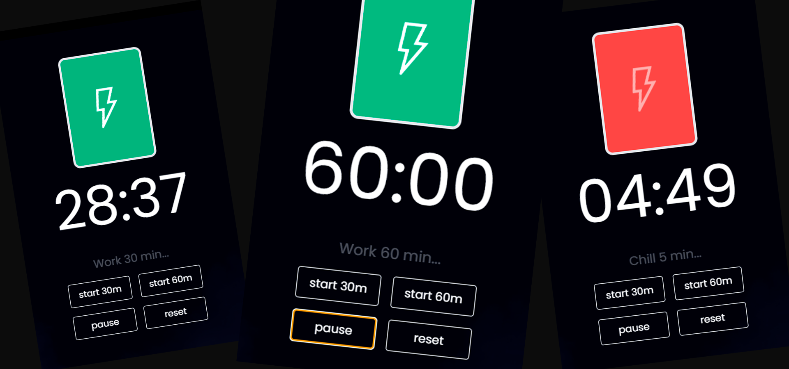

# 👉 **Timer App** — React + Tailwind CSS + Electron
<br><br>

<br><br>
<div align="center">

## EN
A simple timer for work and focus, created with **React** and **Electron**.  
Allows you to track your work time, take pauses, and increase your productivity.

<br>

## RU
Простой таймер для работы и фокусировки, созданный на **React** и **Electron**.  
Позволяет отслеживать время работы, делать паузы и повышать продуктивность.

</div>

<br><br>
<h1>⚙️ Tech Stack</h1>
<br>
<div align="center">
  
  
  
  
</div>
<br>

<h1>🚀 Features</h1>
<br><br>
<ul>
  <li>Настраиваемый рабочий и перерывный таймер</li>
  <li>Использует кастомные React-хуки</li>
  <li>Чистая и модульная структура кода</li>
  <li>Адаптивный дизайн, оптимизированный под любые устройства</li>
  <li>Работает как отдельное настольное приложение через Electron</li>
</ul>
<br><br>

<h1>📦 Installation</h1>

```bash
# Клонируем репозиторий
git clone https://github.com/Kushovka/timer_to_work.git

# Переходим в папку проекта
cd timer_to_work

# Устанавливаем зависимости
npm install

# Запускаем проект как разработчик
npm run dev
npm start

# Запуск десктопного приложения через Electron
npm run build
npm run dist
```

<br>
<h1>☎️ Connect with me </h1>
 <br>
    <div align="center">
        <a href="https://t.me/kushovka">

        </a>
        <a href="https://www.instagram.com/kushovka">

        </a>
        <a href="mailto:kushovk2003@mail.ru">

        </a>
           </a>
        <a href="https://www.linkedin.com/in/kirill-kushov-9714b9364?utm_source=share&utm_campaign=share_via&utm_content=profile&utm_medium=ios_app">

        </a>
</div>
 <br>
 
